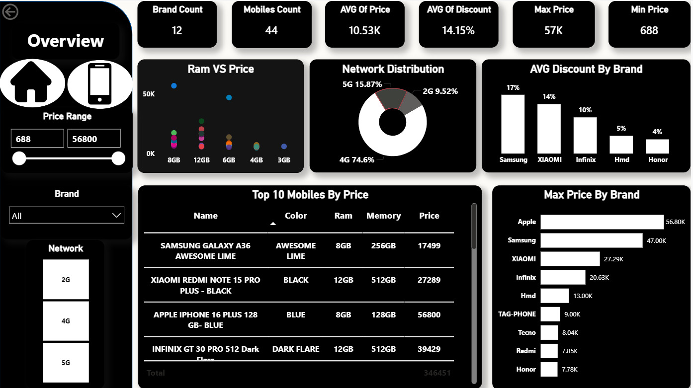
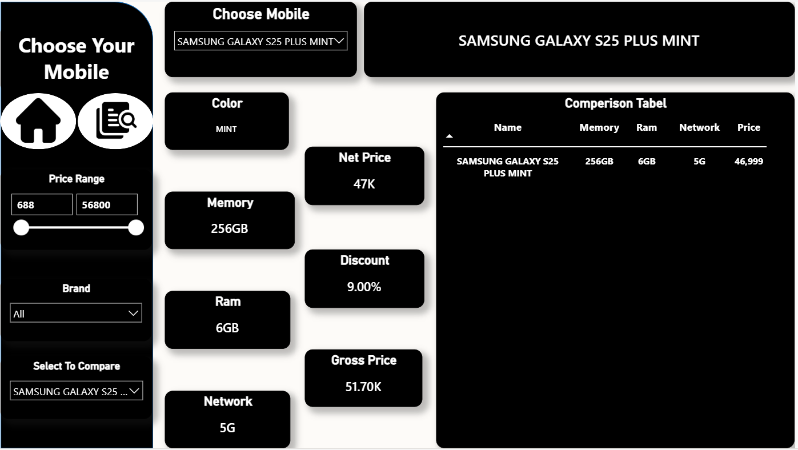

# 📱 Mobile Market Dashboard

## 📊 Overview
An interactive Power BI dashboard analyzing mobile data (price, RAM, and storage) to help users choose suitable phone.

---

## 🚀 Features
* Interactive filters (Slicers) for better exploration
* Analysis of price, RAM, and storage
* Brand comparison and market insights
* Mobile comparison tool
* Clean and user-friendly design

---

## 🏠 Home Page
The home page provides smooth navigation between all dashboard pages.


---

## 📈 Overview Page
The Overview page provides a high-level summary of the mobile market, including:

* Total number of brands
* Total number of mobile phones
* Average price and discount

### 🔍 Key Insights:
* Higher RAM does not always mean a higher price
* Distribution of network types (2G, 3G, 4G, 5G)
* Identification of the most expensive brands



---

## 🔍 Comparison Page
This page allows users to select and compare mobile phones based on:

* Storage (Memory)
* RAM
* Network
* Color
* Price

Helping users make better purchasing decisions.



---

## 🎬 Demo Video
▶️ **Dashboard Demo:** [Watch on Drive](https://drive.google.com/drive/u/2/home)  

---

## 🛠️ Tools Used
* Power BI
* Python (for data scraping)
* Data Cleaning & Transformation
* DAX
* BeautifulSoup & requests (for scraping)

---

## 📁 Project Files
* Power BI Dashboard: `Mobile_Market_Dash.pbix`
* Dataset: `Dataset/products.csv`
* Code (Scraping Script): [`code/scrape_data.py`](scrapping_project.ipynb)
* Screenshots: `Images/` folder

---

## 🎯 Conclusion
This dashboard helps users understand the mobile market and choose the best phone based on their needs through interactive and visual insights.

---

## 💡 Notes
- Make sure Python dependencies are installed to run the scraping script:
```bash
pip install requests beautifulsoup4 pandas
